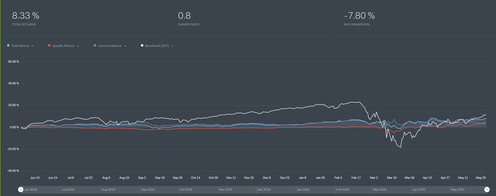

# multifactor-index

## Defining a Purpose
The goal of this project is to develop an executable multi-factor indexing algorythim that creates a mean's tested portfolio for long-term investment purposes that maximizes risk-adjusted returns.

## Introduction
This GitHub repository contains the code for an algorythm that can be used in quantopian. The returns in the algorythm in its current state are not as optimal as possible, but the structure for an investment strategy that involves both longs and shorts that is done with technical analysis of common financial metrics is there to be modified according to the desired positions of the user. Using simple metrics like Closing Price, Simple Moving Average, and Historical Returns, we were able to outperform "common returns" on Quantopian, which means that we were able to outperform others who were using these same "factors" in their algorythms. In the future, this can be expanded upon to use much more complicated analysis, as well as optimized with machine learning. 

Additionally, we designed this to be compatible with Alpaca, a trading platform that allows you to use Python/Quantopian/Pandas to create automated trading strategies. This was done with pyvlivetrading to help make the transition as smooth as possible to Alpaca. While our Quantopian algorythm executes weekly, the Alpaca one is set to run daily to demonstrate its capabilities. 

## Code

*  In the Algo Folder:
  
    * long_short_algo is a simple "Long/Short" strategy that can be used in Quantopian, for testing/research purposes.
    
    * Project1Final is the backtesting code in Quantopian.
    
    * Algo_Final_Pylivetrader is the final code for the algorythm as used in Alpaca. Implemented daily rather than weekly. 

## How this is useful to you:

If you are interested in using an algorythm to develop an investment strategy, playing with this code in quantopian can help you better understand how to use it as a way to backtest any given strategy. Additionally, if you are looking for guidance as to how to transfer your quantopian strategy to Alpaca, there is code for how we were able to do that as well in this repository. 

Most importantly, this is a way to demonstrate how useful Quantopian can be for someone trying to develop an investment strategies with little knowledge of how to use API's. During our time on this project we were able to focus much more on the trading and finance aspect of the strategy, and less on the gathering of the data--which I am sure can be greatly appreciated by all those who work in Data Science/Analysis. 

## Tools
* Alpaca

* Quantopian 

* Python

* Pandas

## Methodology

1. Quantitative Research Notebook in Quantopian
2. Backtest Pipeline/Algorithm 
3. Translate quantopian algorithm to pylivetrader
4. Connect Alpaca account to algorithm
5. Run algorithm in command Line
6. Monitor Results on Alpaca Interface

We followed these steps in order to create the algorythm and then move it over to Alpaca. 

### Team

Javier Mendez, Grant DePalma, Dave Rea, Subbaiah Kotha.

**Group 1:**  
Javier and Subbaiah  

**Quantopian**

**Group 2:**  
Grant and Dave  

**Alpaca**

### Version 1.0.0

Live Date: June 18, 2020

Goals:
1. In groups of 2, develop the Alpaca and Quantopian aspects of the project for the first week of the project. 
2. Meet halfway on June 13 after structure has been created to finalize the structure and begin testing to optimize results in an attempt to beat common returns. 
3. On June 16, make finishing touches and final changes to ensure profitability and over-performance relative to other algorythms using similar factors. 

## Results

[Image of Returns](Images/numbers-final.JPG)

[Image of Tearsheet from Research (broken into quantiles)](Images/tearsheet.png)

## Resources: 
[Article on Multi Factor Small Beta](https://www.quantopian.com/posts/multi-factor-smart-beta-strategy-you-can-actually-use-with-confidence)

[How to put a Quantopian Pipeline into Alpaca](https://alpaca.markets/docs/alpaca-works-with/quantopian-to-pipeline-live/
)
